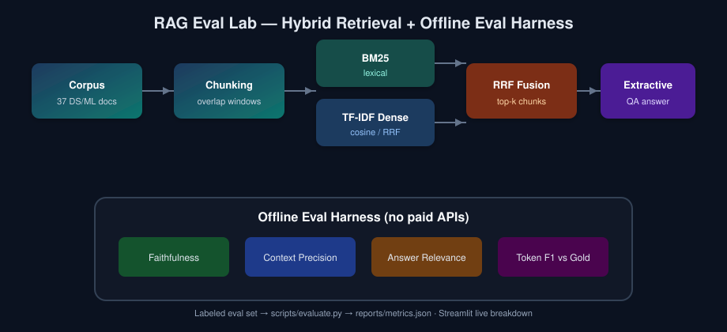

# RAG Eval Lab

> **Not just "chat with docs."** A hireable 2026 DS/ML portfolio piece: hybrid retrieval + extractive generation + an **automated evaluation harness** (faithfulness, context precision/recall, answer relevance) that runs **fully offline** — no API keys.



**Repo:** https://github.com/rohithvairavel-ctrl/rag-eval-lab

## Why this project

Most RAG demos stop at a chatbot UI. Interviewers care about:

1. **Retrieval quality** — did we fetch the right evidence?
2. **Faithfulness** — is the answer grounded in that evidence?
3. **Regression testing** — can we measure changes when we tweak chunking / fusion / prompts?

This lab implements a small but complete loop: curated corpus → hybrid index → answers → labeled metrics → Streamlit inspection.

## Features

| Piece | Implementation |
|--------|----------------|
| Corpus | 37 self-written DS/ML interview concept notes (`data/corpus/`) |
| Chunking | Paragraph-aware windows with overlap (`src/chunking.py`) |
| Retriever | **Hybrid BM25 + TF-IDF dense** fused with **Reciprocal Rank Fusion** |
| Generator | Offline **extractive QA** (TF-IDF sentence selection + template) — no LLM API |
| Eval set | 20 labeled questions with gold answers + relevant doc ids (`data/eval_set.json`) |
| Metrics | RAGAS-inspired: faithfulness, context precision/recall, context relevance, answer relevance, token F1 |
| UI | Streamlit: ask → retrieved chunks → live metric breakdown + eval report |

Optional: install `sentence-transformers` later and swap the dense branch; the default path stays sklearn/BM25 so `pip install -r requirements.txt` works on a laptop without CUDA.

## Quickstart

```bash
python -m venv .venv
# Windows: .venv\Scripts\activate
source .venv/bin/activate
pip install -r requirements.txt

python scripts/build_index.py
python scripts/evaluate.py
streamlit run app/streamlit_app.py
```

Artifacts:

- `index/` — chunks + TF-IDF matrix (gitignored binaries OK; rebuild locally)
- `reports/metrics.json` — **real** aggregate + per-example scores from `evaluate.py`
- `reports/metrics.md` — readable summary table

## Latest offline metrics

> Generated by `scripts/evaluate.py` on the committed eval set (see `reports/metrics.json` for full dump).

| Metric | Score |
|--------|------:|
| Faithfulness | 0.8922 |
| Context Precision | 0.3400 |
| Context Recall | 0.8250 |
| Context Relevance | 0.2067 |
| Answer Relevance | 0.4094 |
| Answer Token F1 | 0.3076 |
| Hit Rate@k | 1.0000 |

Context precision ≈ 0.34 at `top_k=5` is expected when most questions have 1–2 labeled relevant docs (ceiling ≈ relevant/k). **Hit rate@5 = 1.00** and **context recall = 0.83** show the hybrid retriever surfaces the right evidence; faithfulness stays high because answers are extractive.

## Project layout

```
rag-eval-lab/
├── app/streamlit_app.py
├── data/corpus/
├── data/eval_set.json
├── figures/architecture.svg
├── reports/metrics.json
├── scripts/build_index.py
├── scripts/evaluate.py
├── src/
└── requirements.txt
```

## Interview talking points

- **Hybrid retrieval beats either channel alone** on mixed keyword + paraphrase queries; RRF avoids brittle score calibration between BM25 and cosine.
- **Chunking is a product decision**: overlap recovers boundary entities; metadata (`doc_id`, title) enables citation and precision@k against labeled docs.
- **Faithfulness ≠ answer relevance**: an answer can be on-topic but ungrounded (hallucination), or grounded but off-question.
- **Offline judges for CI**: token-overlap / TF-IDF / NLI-lite heuristics let you fail the build when retrieval regresses.
- **Extractive baseline is a feature**: before wiring GPT-4o, prove retrieval + grounding.
- **Eval set hygiene**: every item has `relevant_doc_ids` so context precision/recall are true IR metrics.

### Design choices for the interview loop

1. Swap TF-IDF dense for MiniLM embeddings — measure delta on the same JSON.
2. Add a cross-encoder reranker on the RRF shortlist.
3. Replace extractive stitching with a local GGUF model while keeping the same faithfulness suite.

## Method notes (metrics)

- **Context precision / recall** — set overlap between retrieved `doc_id`s and labeled relevant ids.
- **Context relevance** — token coverage blended with TF-IDF cosine(question, chunk).
- **Faithfulness** — fraction of answer content tokens supported by retrieved context + sentence-level support.
- **Answer relevance** — question-token coverage blended with TF-IDF(question, answer).
- **Answer token F1** — bag-of-tokens F1 vs gold answer.

## License

Corpus and code are original for this portfolio project. Use freely with attribution.
